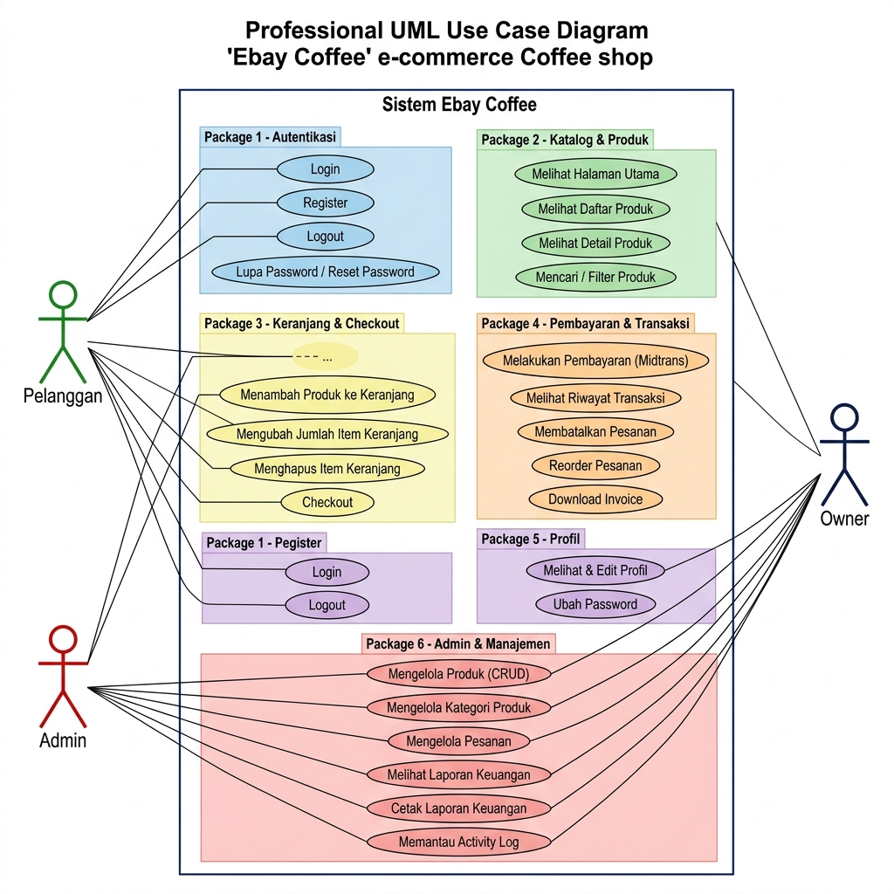
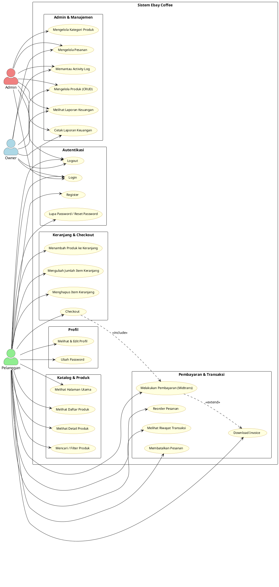
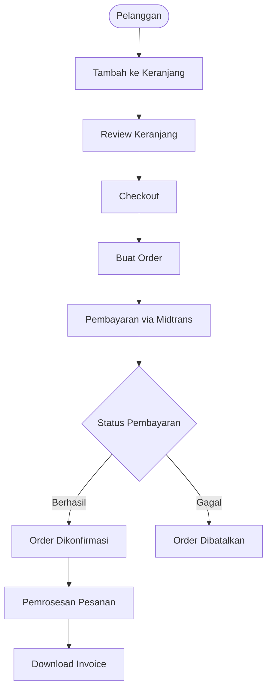

# Use Case Diagram — Sistem Ebay Coffee

## Deskripsi Sistem

Sistem **Ebay Coffee** adalah aplikasi e-commerce toko kopi berbasis web yang dibangun menggunakan Laravel + Filament. Sistem ini memungkinkan pelanggan untuk berbelanja produk kopi secara online, melakukan pembayaran melalui Midtrans, dan memantau riwayat transaksi mereka. Admin dan Owner memiliki akses ke panel manajemen untuk mengelola produk, pesanan, dan laporan keuangan.

---

## Aktor

| Aktor | Role | Deskripsi |
|-------|------|-----------|
| **Pelanggan** | `pelanggan` | Pengguna akhir yang berbelanja produk kopi. Dapat menelusuri produk, menambah ke keranjang, checkout, dan memantau pesanan. |
| **Admin** | `admin` | Administrator toko yang mengelola produk, kategori, pesanan, dan memantau aktivitas sistem melalui panel Filament. |
| **Owner** | `owner` | Pemilik toko yang memiliki akses ke laporan keuangan dan pemantauan sistem. |

---

## Diagram Use Case

---

## Diagram Use Case (PlantUML)

> **Catatan:** Diagram PlantUML dapat di-render menggunakan [PlantText](https://www.planttext.com/), [draw.io](https://app.diagrams.net/), VS Code extension PlantUML, atau tools UML lainnya.

---

## Diagram Use Case (Mermaid)

```mermaid
flowchart LR
    Pelanggan(["🛒 Pelanggan"])
    Admin(["🛡️ Admin"])
    Owner(["👑 Owner"])

    subgraph AUTH["🔐 Autentikasi"]
        UC_LOGIN(["Login"])
        UC_REGISTER(["Register"])
        UC_LOGOUT(["Logout"])
        UC_FORGOT(["Lupa Password / Reset"])
    end

    subgraph KATALOG["📦 Katalog & Produk"]
        UC1(["Melihat Halaman Utama"])
        UC2(["Melihat Daftar Produk"])
        UC3(["Melihat Detail Produk"])
        UC4(["Mencari / Filter Produk"])
    end

    subgraph KERANJANG["🛍️ Keranjang & Checkout"]
        UC5(["Menambah ke Keranjang"])
        UC6(["Mengubah Jumlah Item"])
        UC7(["Menghapus Item Keranjang"])
        UC8(["Checkout"])
    end

    subgraph TRANSAKSI["💳 Pembayaran & Transaksi"]
        UC9(["Melakukan Pembayaran (Midtrans)"])
        UC10(["Melihat Riwayat Transaksi"])
        UC11(["Membatalkan Pesanan"])
        UC12(["Reorder Pesanan"])
        UC13(["Download Invoice"])
    end

    subgraph PROFIL["👤 Profil"]
        UC14(["Melihat & Edit Profil"])
        UC15(["Ubah Password"])
    end

    subgraph MANAJEMEN["⚙️ Admin & Manajemen"]
        UC16(["Mengelola Produk (CRUD)"])
        UC17(["Mengelola Kategori Produk"])
        UC18(["Mengelola Pesanan"])
        UC19(["Melihat Laporan Keuangan"])
        UC20(["Cetak Laporan Keuangan"])
        UC21(["Memantau Activity Log"])
    end

    Pelanggan --> UC_LOGIN & UC_REGISTER & UC_LOGOUT & UC_FORGOT
    Pelanggan --> UC1 & UC2 & UC3 & UC4
    Pelanggan --> UC5 & UC6 & UC7 & UC8
    Pelanggan --> UC9 & UC10 & UC11 & UC12 & UC13
    Pelanggan --> UC14 & UC15

    Admin --> UC_LOGIN & UC_LOGOUT
    Admin --> UC16 & UC17 & UC18 & UC19 & UC20 & UC21

    Owner --> UC_LOGIN & UC_LOGOUT
    Owner --> UC16 & UC18 & UC19 & UC20 & UC21

    style Pelanggan fill:#d1fae5,stroke:#059669,stroke-width:2px,color:#000
    style Admin fill:#fecaca,stroke:#dc2626,stroke-width:2px,color:#000
    style Owner fill:#dbeafe,stroke:#1d4ed8,stroke-width:2px,color:#000
```

---

## Detail Use Case per Aktor

### 🛒 Pelanggan

| ID | Use Case | Deskripsi | Auth Required |
|----|----------|-----------|:---:|
| UC_LOGIN | Login | Masuk ke akun menggunakan email & password. | ✗ |
| UC_REGISTER | Register | Mendaftar sebagai pelanggan baru. | ✗ |
| UC_LOGOUT | Logout | Keluar dari sesi aktif. | ✓ |
| UC_FORGOT | Lupa Password | Mengirim link reset password ke email. | ✗ |
| UC1 | Melihat Halaman Utama | Menelusuri halaman beranda toko kopi. | ✗ |
| UC2 | Melihat Daftar Produk | Melihat semua produk kopi yang tersedia di halaman `/shop`. | ✗ |
| UC3 | Melihat Detail Produk | Melihat informasi lengkap satu produk. | ✗ |
| UC4 | Mencari / Filter Produk | Menyaring produk berdasarkan kategori atau kata kunci. | ✗ |
| UC5 | Menambah ke Keranjang | Menambahkan produk ke keranjang belanja. | ✓ |
| UC6 | Mengubah Jumlah Item | Memperbaharui jumlah item di keranjang. | ✓ |
| UC7 | Menghapus Item Keranjang | Menghapus item dari keranjang belanja. | ✓ |
| UC8 | Checkout | Memproses keranjang menjadi pesanan. | ✓ |
| UC9 | Melakukan Pembayaran | Membayar pesanan menggunakan gateway Midtrans. | ✓ |
| UC10 | Melihat Riwayat Transaksi | Memantau seluruh riwayat pesanan di `/transaksi`. | ✓ |
| UC11 | Membatalkan Pesanan | Membatalkan pesanan yang belum diproses. | ✓ |
| UC12 | Reorder Pesanan | Memesan ulang item dari transaksi sebelumnya. | ✓ |
| UC13 | Download Invoice | Mengunduh/mencetak invoice dari pesanan. | ✓ |
| UC14 | Edit Profil | Memperbarui data nama, email, dan informasi profil. | ✓ |
| UC15 | Ubah Password | Mengganti password akun. | ✓ |

---

### 🛡️ Admin

| ID | Use Case | Deskripsi |
|----|----------|-----------|
| UC_LOGIN | Login | Masuk ke panel admin Filament. |
| UC_LOGOUT | Logout | Keluar dari panel admin. |
| UC16 | Mengelola Produk | Tambah, ubah, hapus produk kopi (CRUD) beserta gambar dan stok. |
| UC17 | Mengelola Kategori | Tambah, ubah, hapus kategori produk. |
| UC18 | Mengelola Pesanan | Memantau dan memperbarui status pesanan pelanggan. |
| UC19 | Melihat Laporan Keuangan | Melihat ringkasan dan detail laporan keuangan toko. |
| UC20 | Cetak Laporan Keuangan | Mencetak laporan keuangan dalam format yang dapat dicetak. |
| UC21 | Memantau Activity Log | Melihat log aktivitas seluruh pengguna di sistem. |

---

### 👑 Owner

| ID | Use Case | Deskripsi |
|----|----------|-----------|
| UC_LOGIN | Login | Masuk ke panel owner Filament. |
| UC_LOGOUT | Logout | Keluar dari panel owner. |
| UC16 | Mengelola Produk | Memiliki akses ke manajemen produk. |
| UC18 | Mengelola Pesanan | Memantau status semua pesanan. |
| UC19 | Melihat Laporan Keuangan | Melihat laporan keuangan dan performa penjualan. |
| UC20 | Cetak Laporan Keuangan | Mencetak laporan keuangan. |
| UC21 | Memantau Activity Log | Memantau seluruh aktivitas di sistem. |

---

## Alur Checkout & Pembayaran

---

## Aturan Bisnis Utama

1. **Keranjang hanya untuk pelanggan yang login.** Guest tidak dapat menambah ke keranjang.
2. **Pembayaran menggunakan Midtrans.** Notifikasi pembayaran diterima secara otomatis melalui webhook.
3. **Pembatalan hanya bisa dilakukan pada status tertentu.** Pesanan yang sudah diproses tidak dapat dibatalkan.
4. **Admin dan Owner tidak dapat berbelanja** melalui panel Filament (terpisah dari halaman toko).
5. **Activity Log** mencatat setiap aksi penting di sistem untuk audit trail.

---

*Dokumen ini dibuat berdasarkan analisis kode sumber proyek Ebay Coffee.*  
*Terakhir diperbarui: Juli 2026*
